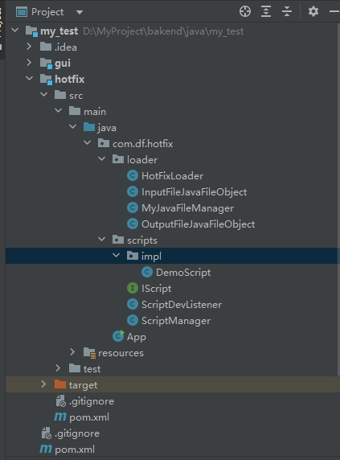
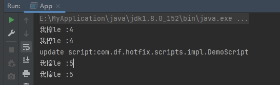
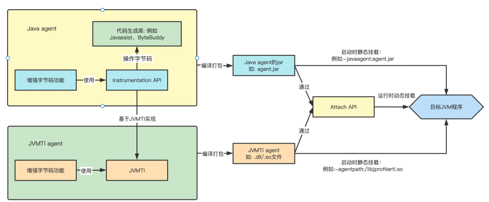
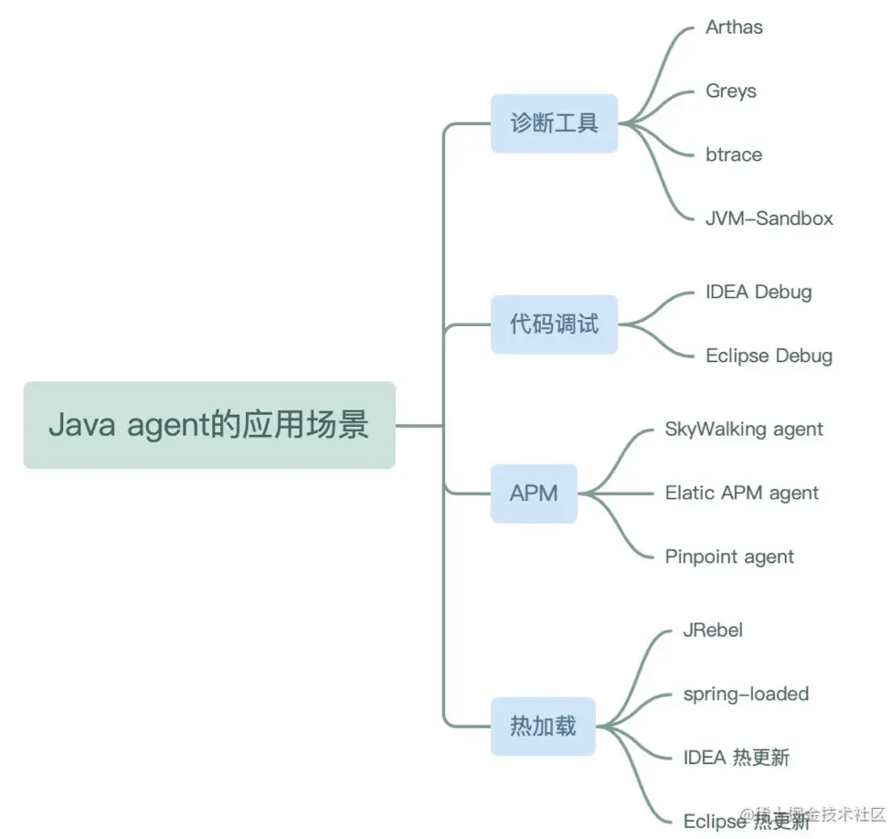
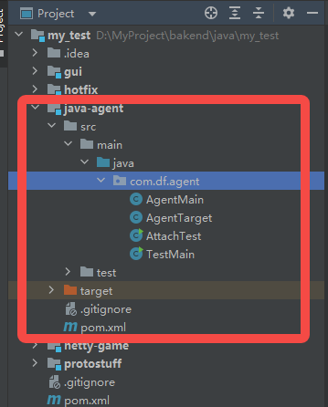
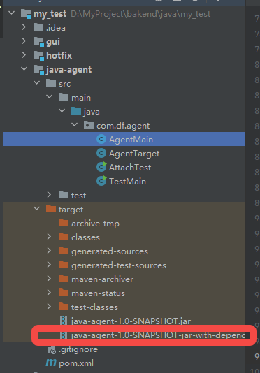
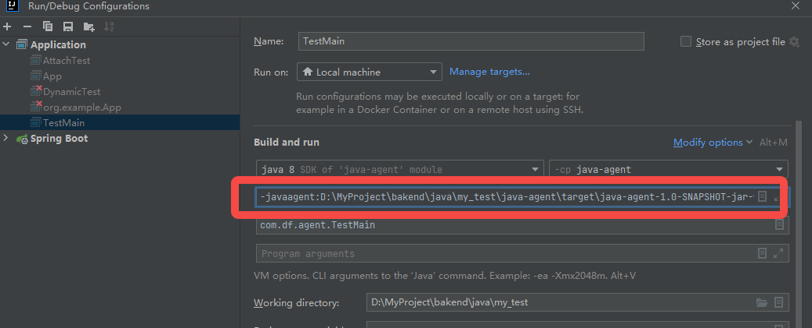

# 代码热更新
## 常见热更新方式
- 动态编译+实例替换
- javaagent+instrument远程attach进行虚拟机中的字节码更改

## 动态编译+实例替换
> 大致原理：
    有新改变时，创建新的加载器进行加载，先自己加载，没有的才用父加载器加载

> 开发阶段：
我们要替换的对象一般是被容器管理，且有实现固定接口，替换的是容器中的实例
指定要监听的目录，定时检测这个目录的文件是否变化（比较文件的改变时间戳），有改变
则进行源代码进行编译，编译后获取字节码对象，创建实例，替换容器中的对象

> 因为要动态编译代码，因此要依赖Java提供的工具类JavaCompiler，在jdk安装目录lib下的tools.jar，项目要依赖此Java

代码案例如下：

目录如下：


测试类：
```java
/**
 * 开发阶段热更新（每隔几秒检测一次文件夹下文件变更[脚本变更]，动态编译Java文件）
 * 已上线热更新（Javaagent,classloader）
 * 远程调试
 */
public class App {
    public static void main(String[] args) throws Exception {
        ScriptManager.instance().loadScripts();

        ScriptDevListener.instance().listenerStart();
        while (true){
            IScript script = ScriptManager.instance().getScript(DemoScript.class.getName());
            script.excute();
            Thread.sleep(3000);
        }

    }
}
```

脚本接口(所有需要热更新的类都继承此接口，方便容器管理)：
```java
package com.df.hotfix.scripts;

public interface IScript {
    void excute();
}

```
脚本管理器：
```java
package com.df.hotfix;

import com.df.hotfix.loader.InputFileJavaFileObject;
import com.df.hotfix.loader.MyJavaFileManager;
import com.df.hotfix.scripts.IScript;
import com.df.hotfix.scripts.ScriptDevListener;
import com.df.hotfix.scripts.ScriptManager;
import com.df.hotfix.scripts.impl.DemoScript;

import javax.tools.JavaCompiler;
import javax.tools.ToolProvider;
import java.io.ByteArrayOutputStream;
import java.io.File;
import java.io.FileInputStream;
import java.io.IOException;
import java.net.URI;
import java.nio.charset.StandardCharsets;
import java.util.Arrays;

/**
 * 开发阶段热更新（每隔几秒检测一次文件夹下文件变更[脚本变更]，动态编译Java文件）
 * 已上线热更新（Javaagent,classloader）
 * 远程调试
 */
public class App {
    public static void main(String[] args) throws Exception {
        ScriptManager.instance().loadScripts();

        ScriptDevListener.instance().listenerStart();
        while (true){
            IScript script = ScriptManager.instance().getScript(DemoScript.class.getName());
            script.excute();
            Thread.sleep(3000);
        }

    }

    public static void compileTest() throws IOException {
        String path = "D:\\MyProject\\bakend\\java\\my_test\\hotfix\\src\\main\\java\\com\\df\\hotfix\\scripts\\impl\\DemoScript.java";
        JavaCompiler compiler = ToolProvider.getSystemJavaCompiler();
// 自定义 JavaFileManager 方便自定义输入和输出
        MyJavaFileManager myJavaFileManager = new MyJavaFileManager(compiler.getStandardFileManager(null, null, StandardCharsets.UTF_8));
        JavaCompiler.CompilationTask task = compiler
                .getTask(null, myJavaFileManager, null, null, null,
                        Arrays.asList(new InputFileJavaFileObject(new File(path), "com.df.hotfix.scripts.impl.DemoScript")));
        // 同步调用
        task.call();
        myJavaFileManager.getByteArrayJavaFileObjects().forEach(b1->{
            try {
                ByteArrayOutputStream o= (ByteArrayOutputStream) b1.openOutputStream();
                // 获取字节码
                byte[] classByteArray = o.toByteArray();
                // 加载对象 ，这里是有问题的，我们应该 是在ClassLoader 中编译，并加载
                ClassLoader loader = new ClassLoader() {
                    @Override
                    protected Class<?> findClass(String name) throws ClassNotFoundException {
                        return defineClass(name, classByteArray, 0, classByteArray.length);
                    }
                };
                Class<?> clazz = loader.loadClass("com.df.hotfix.scripts.impl.DemoScript");
                if (IScript.class.isAssignableFrom(clazz)){
                    IScript instance = (IScript) clazz.newInstance();
                    instance.excute();
                }
            } catch (IOException e) {
                e.printStackTrace();
            } catch (ReflectiveOperationException e) {
                e.printStackTrace();
            }
        });
    }
}

```

脚本实现（本次为测试，只实现了一个）：
```java
package com.df.hotfix.scripts.impl;

import com.df.hotfix.scripts.IScript;

public class DemoScript implements IScript {
    private String str = "5";
    @Override
    public void excute() {
        System.out.println("我擦le :"+str);
    }

    @Override
    public String toString() {
        return "DemoScript{" +
                "str='" + str + '\'' +
                '}';
    }
}

```

自定义加载器：
```java
package com.df.hotfix.loader;

import com.df.hotfix.scripts.IScript;

import javax.tools.JavaCompiler;
import javax.tools.ToolProvider;
import java.io.*;
import java.nio.charset.StandardCharsets;
import java.util.Arrays;

public class HotFixLoader extends ClassLoader {

    String checkPath = "D:\\MyProject\\bakend\\java\\my_test\\hotfix\\src\\main\\java";
    JavaCompiler compiler = null;
    MyJavaFileManager myJavaFileManager;

    public HotFixLoader() {
        compiler = ToolProvider.getSystemJavaCompiler();
        // 自定义 JavaFileManager 方便自定义输入和输出
        myJavaFileManager = new MyJavaFileManager(compiler.getStandardFileManager(null, null, StandardCharsets.UTF_8));
    }

    @Override
    public Class<?> loadClass(String name) throws ClassNotFoundException {
        if (name.startsWith("com.df.hotfix.scripts.impl")) {
            Class<?> aClass = this.findClass(name);
            if (aClass == null) {
                return this.getParent().loadClass(name);
            }
            return aClass;
        } else {
            return this.getParent().loadClass(name);
        }
    }

    @Override
    protected Class<?> findClass(String name) throws ClassNotFoundException {
        String path = checkPath + File.separator + name.replace(".", "/") + ".java";
        JavaCompiler.CompilationTask task = null;
        try {
            task = compiler
                    .getTask(null, myJavaFileManager, null, null, null,
                            Arrays.asList(new InputFileJavaFileObject(new File(path), name)));
            // 同步调用
            task.call();
            OutputFileJavaFileObject outputFileJavaFileObject = myJavaFileManager.getByteArrayJavaFileObjects().stream().findAny().get();

            ByteArrayOutputStream o = (ByteArrayOutputStream) outputFileJavaFileObject.openOutputStream();
            // 获取字节码
            byte[] classByteArray = o.toByteArray();
            return defineClass(name, classByteArray, 0, classByteArray.length);
        } catch (IOException e) {
            e.printStackTrace();
            return null;
        }

    }
}

```
因为我们是将Java文件编译到内存，不写到本地文件，因此用到了文件管理器

java文件管理器（用于管理）：
```java
package com.df.hotfix.loader;

import javax.tools.FileObject;
import javax.tools.ForwardingJavaFileManager;
import javax.tools.JavaFileManager;
import javax.tools.JavaFileObject;
import java.io.IOException;
import java.util.HashSet;
import java.util.Set;

public class MyJavaFileManager extends ForwardingJavaFileManager<JavaFileManager> {
    // 就是一个装饰着模式  ForwardingJavaFileManager

    /**
     * Creates a new instance of ForwardingJavaFileManager.
     *
     * @param fileManager delegate to this file manager
     */
    public MyJavaFileManager(JavaFileManager fileManager) {
        super(fileManager);
    }

    private final Set<OutputFileJavaFileObject> byteArrayJavaFileObjects = new HashSet<>();

    public Set<OutputFileJavaFileObject> getByteArrayJavaFileObjects() {
        return byteArrayJavaFileObjects;
    }

    // 有字节码的输出的时候 我们自定义一个JavaFileObject 来接受输出了
    @Override
    public JavaFileObject getJavaFileForOutput(JavaFileManager.Location location, String className, JavaFileObject.Kind kind, FileObject sibling) throws IOException {
        if (JavaFileObject.Kind.CLASS == kind) {
            OutputFileJavaFileObject byteArrayJavaFileObject = new OutputFileJavaFileObject(className);
            byteArrayJavaFileObjects.add(byteArrayJavaFileObject);
            return byteArrayJavaFileObject;
        } else {
            return super.getJavaFileForOutput(location, className, kind, sibling);
        }
    }
}

```

输入文件对象实现：
```java
package com.df.hotfix.loader;

import javax.tools.SimpleJavaFileObject;
import java.io.File;
import java.io.IOException;
import java.net.URI;
import java.nio.file.Files;
import java.nio.file.Paths;

public class InputFileJavaFileObject extends SimpleJavaFileObject {

    String fileContent = null;

    /**
     * Construct a SimpleJavaFileObject of the given kind and with the
     * given URI.
     *
     * @param file      Java源文件
     * @param className 文件类型
     */
    public InputFileJavaFileObject(File file, String className) throws IOException {
        super(URI.create("string:///" + className.replace(".", "/") + ".java"), Kind.SOURCE);
        byte[] bytes = Files.readAllBytes(Paths.get(file.getAbsolutePath()));
        this.fileContent = new String(bytes,"utf-8");
    }


    @Override
    public CharSequence getCharContent(boolean ignoreEncodingErrors) throws IOException {
        return this.fileContent;
    }
}

```

输出文件对象实现：
```java
package com.df.hotfix.loader;

import javax.tools.SimpleJavaFileObject;
import java.io.ByteArrayOutputStream;
import java.io.IOException;
import java.io.OutputStream;
import java.net.URI;

public class OutputFileJavaFileObject extends SimpleJavaFileObject {
    /**
     * Construct a SimpleJavaFileObject of the given kind and with the
     * given URI.
     */
    private final ByteArrayOutputStream outputStream = new ByteArrayOutputStream();

    public OutputFileJavaFileObject(String className) {
        super(URI.create("bytes:///" + className.replace(".", "/") + ".class"), Kind.CLASS);
    }

    @Override
    public OutputStream openOutputStream() throws IOException {
        return outputStream;
    }
}

```

测试结果：


>生产阶段：
可以省去编译的环节，在本地修改好后编译成.class文件，上传到线上指定热更新目录，然后GM后台给线上服务器发送
热更新指令，线上服务器创建新的加载器实例进行指定目录class文件加载即可
或者直接GM后台传输包名和字节码（或源文件）到线上服，线上服进行加载（或编译后加载）替换
## Javaagent

技术关系图如下：


Java agent 技术结合 Java Intrumentation API 可以实现类修改、热加载等功能，下面是 Java agent 技术的常见应用场景：
需要注意：用此方式修改成员值，对于已经创建的实例将不会生效，只有新对象才生效


### 案例演示如下

我们先用一个 Java agent 实现方法开始和结束时打印日志的简单例子来实践一下，通过示例，可以很快对后面 Java agent 技术有初步的理解。

#### 1.开发agent
创建工程，目录如下：



pom.xml，引入javassist用来修改目标类的字节码，增加自定义代码。通过maven-assembly-plugin插件打包自定义的 agent jar。

```xml
    <dependencies>
        <dependency>
            <groupId>org.javassist</groupId>
            <artifactId>javassist</artifactId>
            <version>3.25.0-GA</version>
        </dependency>
    </dependencies>

    <build>
        <plugins>
            <plugin>
                <groupId>org.apache.maven.plugins</groupId>
                <artifactId>maven-assembly-plugin</artifactId>
                <version>3.1.1</version>
                <configuration>
                    <descriptorRefs>
                        <!--将应用的所有依赖包都打到jar包中。如果依赖的是 jar 包，jar 包会被解压开，平铺到最终的 uber-jar 里去。输出格式为 jar-->
                        <descriptorRef>jar-with-dependencies</descriptorRef>
                    </descriptorRefs>
                    <archive>
                        <!-- 设置manifest配置文件-->
                        <manifestEntries>
                            <!--Premain-Class: 代表 Agent 静态加载时会调用的类全路径名。-->
                            <Premain-Class>demo.MethodAgentMain</Premain-Class>
                            <!--Agent-Class: 代表 Agent 动态加载时会调用的类全路径名。-->
                            <Agent-Class>demo.MethodAgentMain</Agent-Class>
                            <!--Can-Redefine-Classes: 是否可进行类定义。-->
                            <Can-Redefine-Classes>true</Can-Redefine-Classes>
                            <!--Can-Retransform-Classes: 是否可进行类转换。-->
                            <Can-Retransform-Classes>true</Can-Retransform-Classes>
                        </manifestEntries>
                    </archive>
                </configuration>
                <executions>
                    <execution>
                        <!--绑定到package生命周期阶段上-->
                        <phase>package</phase>
                        <goals>
                            <!--绑定到package生命周期阶段上-->
                            <goal>single</goal>
                        </goals>
                    </execution>
                </executions>
            </plugin>
        </plugins>
    </build>

```

编写 agent 核心代码 MethodAgentMain.java，我们使用了premain()静态加载方式，agentmain动态加载方式。并用到了Instrumentation类结合javassist代码生成库进行字节码的修改。

AgentMain.class
```java
public class AgentMain
{
    /** 被转换的类 */
    public static final String TRANSFORM_CLASS = "com.df.agent.AgentTarget";

    /** 静态加载。Java agent指定的premain方法，会在main方法之前被调用 */
    public static void premain(String args, Instrumentation instrumentation) {
        System.out.println("premain start!");
        addTransformer(instrumentation);
        System.out.println("premain end!");
    }

    /** 动态加载。Java agent指定的premain方法，会在main方法之前被调用 */
    public static void agentmain(String args, Instrumentation instrumentation) {
        System.out.println("agentmain start!");
        addTransformer(instrumentation);
        Class<?>[] classes = instrumentation.getAllLoadedClasses();
        if (classes != null){
            for (Class<?> c: classes) {
                if (c.isInterface() ||c.isAnnotation() ||c.isArray() ||c.isEnum()){
                    continue;
                }
                if (c.getName().equals(TRANSFORM_CLASS)) {
                    try {
                        System.out.println("retransformClasses start, class: " + c.getName());
                        /*
                         * retransformClasses()对JVM已经加载的类重新触发类加载。使用的就是上面注册的Transformer。
                         * retransformClasses()可以修改方法体，但是不能变更方法签名、增加和删除方法/类的成员属性
                         */
                        instrumentation.retransformClasses(c);
                        System.out.println("retransformClasses end, class: " + c.getName());
                    } catch (UnmodifiableClassException e) {
                        System.out.println("retransformClasses error, class: " + c.getName() + ", ex:" + e);
                        e.printStackTrace();
                    }
                }
            }
        }
        System.out.println("agentmain end!");
    }

    private static void addTransformer (Instrumentation instrumentation) {
        /* Instrumentation提供的addTransformer方法，在类加载时会回调ClassFileTransformer接口 */
        instrumentation.addTransformer(new ClassFileTransformer() {
            public byte[] transform(ClassLoader l, String className, Class<?> c, ProtectionDomain pd, byte[] b){
                try {
                    className = className.replace("/", ".");
                    if (className.equals(TRANSFORM_CLASS)) {
                        final ClassPool classPool = ClassPool.getDefault();
                        final CtClass clazz = classPool.get(TRANSFORM_CLASS);

                        for (CtMethod method : clazz.getMethods()) {
                            /*
                             * Modifier.isNative(methods[i].getModifiers())过滤本地方法,否则会报
                             * javassist.CannotCompileException: no method body  at javassist.CtBehavior.addLocalVariable()
                             * 报错原因如下
                             * 来自Stack Overflow网友解答
                             * Native methods cannot be instrumented because they have no bytecodes.
                             * However if native method prefix is supported ( Transformer.isNativeMethodPrefixSupported() )
                             * then you can use Transformer.setNativeMethodPrefix() to wrap a native method call inside a non-native call
                             * which can then be instrumented
                             */
                            if (Modifier.isNative(method.getModifiers())) {
                                continue;
                            }

                            method.insertBefore("System.out.println(\"" + clazz.getSimpleName() + "."
                                    + method.getName() + " start.\");");
                            method.insertAfter("System.out.println(\"" + clazz.getSimpleName() + "."
                                    + method.getName() + " end.\");", false);
                        }

                        return clazz.toBytecode();
                    }
                } catch (Exception e) {
                    e.printStackTrace();
                }

                return null;
            }
        }, true);
    }
}
```

被修改的类：
AgentTarget.java
```java
public class AgentTarget {

    public void testM(){
        System.out.println(1);
    }
}
```

编译打包:

执行 mvn clean package 编译打包，最终打包生成了 agent jar 包，结果示例：





编写测试类：

TestMain.java
```java
public class TestMain {
    public static void main(String[] args) throws InterruptedException {
        AgentTarget target = new AgentTarget();
        for (int i = 0; i < 1000; i++) {
            target.testM();
            Thread.sleep(5000);
        }
    }

}
```
#### 2.使用 java agent 静态加载方式实现
在 IDEA 的 Run/Debug Configurations 中，点击 Modify options，勾选上 add VM options，在 VM options 栏增加 -javaagent:D:\MyProject\bakend\java\my_test\java-agent\target\java-agent-1.0-SNAPSHOT-jar-with-dependencies.jar




运行结果：
screenshot-20230525-175103.png

#### 3.使用 java agent 动态加载方式实现
动态加载不是通过 -javaagent: 的方式实现，而是通过 Attach API 的方式。

编写调用 Attach API 的测试类

AttachTest.java
```java
public class AttachTest {
    public static void main(String[] args) throws Exception {
        List<VirtualMachineDescriptor> listBefore = VirtualMachine.list();
        // agentmain()方法所在jar包
        String jar = "D:\\MyProject\\bakend\\java\\my_test\\java-agent\\target\\java-agent-1.0-SNAPSHOT-jar-with-dependencies.jar";

        for (VirtualMachineDescriptor virtualMachineDescriptor : VirtualMachine.list()) {
            // 针对指定名称的JVM实例
            if (virtualMachineDescriptor.displayName().equals("com.df.agent.TestMain")) {
                System.out.println("将对该进程的vm进行增强：org.example.agent.AgentTest的vm进程, pid=" + virtualMachineDescriptor.id());
                // attach到新JVM
                VirtualMachine vm = VirtualMachine.attach(virtualMachineDescriptor);
                // 加载agentmain所在的jar包
                vm.loadAgent(jar);
                // detach
                vm.detach();
            }
        }
    }
}
```

先直接运行 TestMain，注意不用加 -javaagent: 启动参数。

```shell
1
1

```

再运行 AttachTest，可以看到 AttachTest#main 打印的日志：

结果：
```shell

1
1
1
agentmain start!
retransformClasses start, class: com.df.agent.AgentTarget
retransformClasses end, class: com.df.agent.AgentTarget
agentmain end!
AgentTarget.testM start.
1
AgentTarget.testM end.
AgentTarget.testM start.
1
AgentTarget.testM end.
```

#### 4小结
可以看到静态加载或动态加载相同的 agent，都能实现了记录记录方法运行开始和结束日志的功能。

我们可以稍微扩展一下，打印方法的入参、返回值，也可以实现替换 class，实现热加载的功能。

## 拓展
instrument相关介绍可以看 [java语言基础 - instrument相关介绍](../11.Instrument相关介绍/index.md) <!-- 具体文件可以使用 .md 结尾（推荐）-->