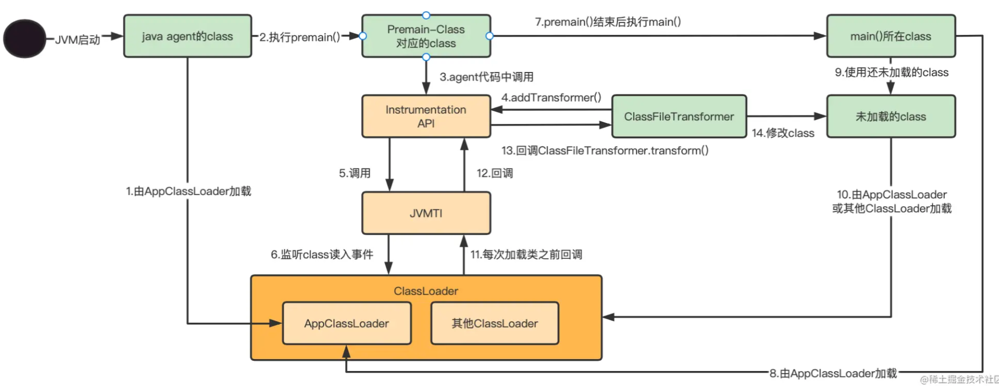
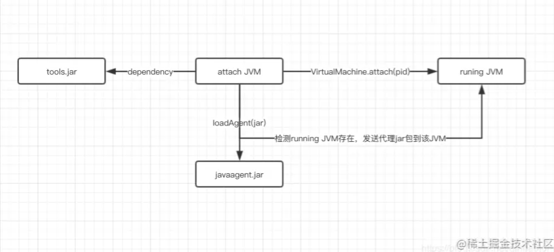
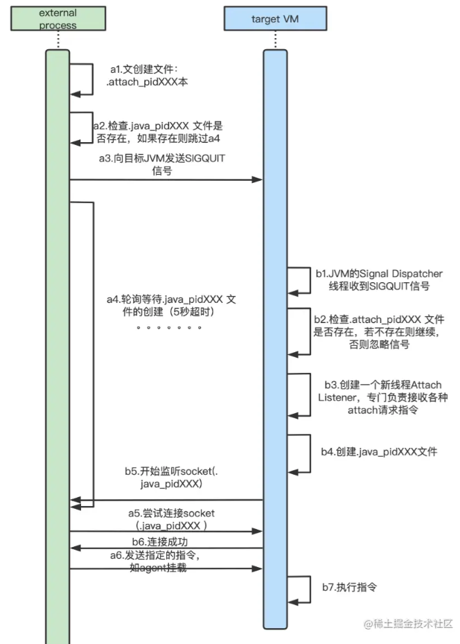

参考：https://juejin.cn/post/7157684112122183693

## 1.Instrumentation API 介绍
Instrumentation是Java提供的JVM接口，该接口提供了一系列查看和操作Java类定义的方法，例如修改类的字节码、向 classLoader 的 classpath 下加入jar文件等。使得开发者可以通过Java语言来操作和监控JVM内部的一些状态，进而实现Java程序的监控分析，甚至实现一些特殊功能（如AOP、热部署）。

Instrumentation的一些主要方法如下：
```java
public interface Instrumentation {
    /**
     * 注册一个Transformer，从此之后的类加载都会被Transformer拦截。
     * Transformer可以直接对类的字节码byte[]进行修改
     */
    void addTransformer(ClassFileTransformer transformer);
    
    /**
     * 对JVM已经加载的类重新触发类加载。使用的就是上面注册的Transformer。
     * retransformClasses可以修改方法体，但是不能变更方法签名、增加和删除方法/类的成员属性
     */
    void retransformClasses(Class<?>... classes) throws UnmodifiableClassException;
    
    /**
     * 获取一个对象的大小
     */
    long getObjectSize(Object objectToSize);
    
    /**
     * 将一个jar加入到bootstrap classloader的 classpath里
     */
    void appendToBootstrapClassLoaderSearch(JarFile jarfile);
    
    /**
     * 获取当前被JVM加载的所有类对象
     */
    Class[] getAllLoadedClasses();
}
```

addTransformer方法配置之后，后续的类加载都会被Transformer拦截。

对于已经加载过的类，可以执行retransformClasses来重新触发这个Transformer的拦截。类加载的字节码被修改后，除非再次被retransform，否则不会恢复。


## 2.Instrumentation的局限性
在运行时，我们可以通过Instrumentation的redefineClasses方法进行类重定义，在redefineClasses方法上有一段注释需要特别注意：
```
     * The redefinition may change method bodies, the constant pool and attributes.
     * The redefinition must not add, remove or rename fields or methods, change the
     * signatures of methods, or change inheritance.  These restrictions maybe be
     * lifted in future versions.  The class file bytes are not checked, verified and installed
     * until after the transformations have been applied, if the resultant bytes are in
     * error this method will throw an exception.
```

这里面提到，我们不可以增加、删除或者重命名字段和方法，改变方法的签名或者类的继承关系。认识到这一点很重要，当我们通过ASM获取到增强的字节码之后，如果增强后的字节码没有遵守这些规则，那么调用redefineClasses方法来进行类的重定义就会失败。

## 3.Java agent
主流的JVM都提供了Instrumentation的实现，但是鉴于Instrumentation的特殊功能，并不适合直接提供在JDK的runtime里，而更适合出现在Java程序的外层，以上帝视角在合适的时机出现。

因此如果想使用Instrumentation功能，拿到Instrumentation实例，我们必须通过Java agent。

Java agent是一种特殊的Java程序（Jar文件），它是Instrumentation的客户端。与普通Java程序通过main方法启动不同，agent 并不是一个可以单独启动的程序，而必须依附在一个Java应用程序（JVM）上，与它运行在同一个进程中，通过Instrumentation API与虚拟机交互。
Java agent与Instrumentation密不可分，二者也需要在一起使用。因为Instrumentation的实例会作为参数注入到Java agent的启动方法中。

### 3.1 Java agent 的格式
> premain和agentmain
Java agent以jar包的形式部署在JVM中，jar文件的manifest需要指定agent的类名。根据不同的启动时机，agent类需要实现不同的方法（二选一）。
(1) JVM 启动时加载
```shell
[1] public static void premain(String agentArgs, Instrumentation inst);
[2] public static void premain(String agentArgs);
```
JVM将首先寻找[1]，如果没有发现[1]，再寻找[2]。
(2) JVM 运行时加载
```shell
[1] public static void agentmain(String agentArgs, Instrumentation inst);
[2] public static void agentmain(String agentArgs);
```
与 premain()一致，JVM将首先寻找[1]，如果没有发现[1]，再寻找[2]。

> 指定MANIFEST.MF
可以通过maven plugin配置，示例：
```xml
<!-- 设置manifest配置文件-->
<manifestEntries>
    <!--Premain-Class: 代表 Agent 静态加载时会调用的类全路径名。-->
    <Premain-Class>demo.MethodAgentMain</Premain-Class>
    <!--Agent-Class: 代表 Agent 动态加载时会调用的类全路径名。-->
    <Agent-Class>demo.MethodAgentMain</Agent-Class>
    <!--Can-Redefine-Classes: 是否可进行类定义。-->
    <Can-Redefine-Classes>true</Can-Redefine-Classes>
    <!--Can-Retransform-Classes: 是否可进行类转换。-->
    <Can-Retransform-Classes>true</Can-Retransform-Classes>
</manifestEntries>
```
生成的MANIFEST.MF，示例：

```xml
Premain-Class: demo.MethodAgentMain
Built-By: terry
Agent-Class: demo.MethodAgentMain
Can-Redefine-Classes: true
Can-Retransform-Classes: true
```
### 3.2 Java agent 的加载
> Java agent 与 ClassLoader
Java agent 的包先会被加入到 system class path 中，然后 agent 的类会被system calss loader(默认AppClassLoader)所加载，和应用代码的真实classLoader无关。例如：当启动参数加上-javaagent:my-agent.jar运行 SpringBoot 打包的 fatjar 时，fatjar 中应用代码和 lib 中嵌套 jar 是由 org.springframework.boot.loader.LaunchedURLClassLoader 加载，但这个 my-agent.jar 依然是在system calss loader(默认AppClassLoader)中加载，而非 org.springframework.boot.loader.LaunchedURLClassLoader 加载。

该类加载逻辑非常重要，在使用 Java agent 时如果遇到ClassNotFoundException、NoClassDefFoundError，很大可能就是与该加载逻辑有关。

> 静态加载、动态加载 Java agent
Java agent 支持静态加载和动态加载。

#### 3.2.1 静态加载 Java agent

静态加载，即 JVM 启动时加载，对应的是 premain() 方法。通过 vm 启动参数-javaagent将 agent jar 挂载到目标 JVM 程序，随目标 JVM 程序一起启动。

(1) -javaagent启动参数
其中 -javaagent格式： "-javaagent:jarpath(option)"。(option)部分可以指定 agent 的参数，可以传递到premain(String agentArgs, Instrumentation inst)方法的agentArgs入参中。支持可以定义多个agent，按指定顺序先后执行。

示例: java -javaagent:agent1.jar=key1=value1&key2=value2 -javaagent:agent2.jar -jar Test.jar


- 其中加载顺序为(1) agent1.jar (2) agent2.jar。

**注意：不同的顺序可能会导致 agent 对类的修改存在冲突，在实际项目中用到了pinpoint和SkyWalking的agent，当通过-javaagent先挂载 pinpoint的 agent ，后挂载 SkyWalking**的 agent，出现 SkyWalking对类的增强发生异常的情况，而先挂载SkyWalking的 agent 则无问题。


- agent1.jar 的premain(String agentArgs, Instrumentation inst)方法的agentArgs值为key1=value1&key2=value2。

(2) premain()方法


premain()方法会在程序main方法执行之前被调用，此时大部分Java类都没有被加载（"大部分"是因为，agent类本身和它依赖的类还是无法避免的会先加载的），是一个对类加载埋点做手脚（addTransformer）的好机会。


如果此时premain方法执行失败或抛出异常，那么JVM的启动会被终止。


premain() 中一般会编写如下步骤：

注册类的 ClassFileTransformer，在类加载的时候会自动更新对应的类的字节码
写法示例：
```java
// Java agent指定的premain方法，会在main方法之前被调用
public static void premain(String args, Instrumentation inst) {
    // Instrumentation提供的addTransformer方法，在类加载时会回调ClassFileTransformer接口
    inst.addTransformer(new ClassFileTransformer() {
        @Override
        public byte[] transform(ClassLoader loader, String className, Class<?> classBeingRedefined,
                                ProtectionDomain protectionDomain, byte[] classfileBuffer) {
            // TODO 字节码修改
            byte[] transformed = null;
            return transformed;
        }
    });
}
```
(3) 静态加载执行流程
agent 中的 class 由 system calss loader(默认AppClassLoader)  加载，premain() 方法会调用 Instrumentation API，然后 Instrumentation API 调用 JVMTI(JVMTI的内容将在后面补充)，在需要加载的类需要被加载时，会回调 JVMTI，然后回调 Instrumentation API，触发ClassFileTransformer.transform()，最终修改 class 的字节码。




(4) ClassFileTransformer.transform()
ClassFileTransformer.transform() 和 ClassLoader.load()的关系
下面是一次 ClassFileTransformer.transform()执行时的方法调用栈，

```java
transform:38, MethodAgentMain$1 (demo)
transform:188, TransformerManager (sun.instrument)
transform:428, InstrumentationImpl (sun.instrument)
defineClass1:-1, ClassLoader (java.lang)
defineClass:760, ClassLoader (java.lang)
defineClass:142, SecureClassLoader (java.security)
defineClass:467, URLClassLoader (java.net)
access$100:73, URLClassLoader (java.net)
run:368, URLClassLoader$1 (java.net)
run:362, URLClassLoader$1 (java.net)
doPrivileged:-1, AccessController (java.security)
findClass:361, URLClassLoader (java.net)
loadClass:424, ClassLoader (java.lang)
loadClass:331, Launcher$AppClassLoader (sun.misc)
loadClass:357, ClassLoader (java.lang)
checkAndLoadMain:495, LauncherHelper (sun.launcher)

```

可以看到 ClassLoader.load()加载类时，ClassLoader.load()会调用ClassLoader.findClass(),ClassLoader.findClass()会调用ClassLoader.defefineClass()，ClassLoader.defefineClass()最终会执行ClassFileTransformer.transform() ，ClassFileTransformer.transform() 可以对类进行修改。所以ClassLoader.load()最终加载 agent 修改后Class对象。
下面是精简后的 ClassLoader.load() 核心代码：

```java
protected Class<?> loadClass(String name, boolean resolve)
    throws ClassNotFoundException
{
    synchronized (getClassLoadingLock(name)) {
        // 判断是否已经加载过了，如果没有，则进行load
        // First, check if the class has already been loaded
        Class<?> c = findLoadedClass(name);
        if (c == null) {
            if (c == null) {
                // If still not found, then invoke findClass in order
                // to find the class.
                long t1 = System.nanoTime();
                // findClass()内部最终会调用 Java agent 中 ClassFileTransformer.transform()
                c = findClass(name);

                // this is the defining class loader; record the stats
                sun.misc.PerfCounter.getParentDelegationTime().addTime(t1 - t0);
                sun.misc.PerfCounter.getFindClassTime().addElapsedTimeFrom(t1);
                sun.misc.PerfCounter.getFindClasses().increment();
            }
        }
        if (resolve) {
            resolveClass(c);
        }
        return c;
    }
}
```

ClassFileTransformer.transform() 和 字节码增强
ClassFileTransformer.transform()  中可以对指定的类进行增强，我们可以选择的代码生成库修改字节码对类进行增强，比如ASM, CGLIB, Byte Buddy, Javassist。

#### 3.2.2  动态加载 Java agent
静态加载，即 JVM 启动后的任意时间点(即运行时)，通过Attach API动态地加载 Java agent，对应的是 agentmain() 方法。
Attach API部分将在后面的章节进行说明。
agentmain()方法
对于VM启动后加载的Java agent，其agentmain()方法会在加载之时立即执行。如果agentmain执行失败或抛出异常，JVM会忽略掉错误，不会影响到正在 running 的 Java 程序。
一般 agentmain() 中会编写如下步骤：

- 注册类的 ClassFileTransformer
- 调用 retransformClasses 方法对指定的类进行重加载

### JVMTI

#### 1 JVMTI 介绍

JVMTI （JVM Tool Interface）是 Java 虚拟机对外提供的 Native 编程接口，通过 JVMTI ，外部进程可以获取到运行时JVM的诸多信息，比如线程、GC等。
JVMTI 是一套 Native 接口，在 Java SE 5 之前，要实现一个 Agent 只能通过编写 Native 代码来实现。从 Java SE 5 开始，可以使用 Java 的Instrumentation 接口（java.lang.instrument）来编写 Agent。无论是通过 Native 的方式还是通过 Java Instrumentation 接口的方式来编写 Agent，它们的工作都是借助 JVMTI 来进行完成。

启动方式

JVMTI和Instumentation API的作用很相似，都是一套 JVM 操作和监控的接口，且都需要通过agent来启动：

- Instumentation API需要打包成 jar，并通过 Java agent 加载（对应启动参数: -javaagent）
- JVMTI 需要打包成动态链接库（随操作系统，如.dll/.so文件），并通过 JVMTI agent 加载（对应启动参数: -agentlib/-agentpath）
#### 2 加载时机
启动时（Agent_OnLoad）和运行时Attach（Agent_OnAttach）

#### 3 功能
Instumentation API 可以支持 Java 语言实现 agent 功能，但是 JVMTI 功能比 Instumentation API 更强大，它支持：

- 获取所有线程、查看线程状态、线程调用栈、查看线程组、中断线程、查看线程持有和等待的锁、获取线程的CPU时间、甚至将一个运行中的方法强制返回值……
- 获取Class、Method、Field的各种信息，类的详细信息、方法体的字节码和行号、向Bootstrap/System Class Loader添加jar、修改System Property……
- 堆内存的遍历和对象获取、获取局部变量的值、监测成员变量的值……
- 各种事件的callback函数，事件包括：类文件加载、异常产生与捕获、线程启动和结束、进入和退出临界区、成员变量修改、gc开始和结束、方法调用进入和退出、临界区竞争与等待、VM启动与退出……
- 设置与取消断点、监听断点进入事件、单步执行事件……

#### 4  JVMTI 与 Java agent
Java agent 是基于 JVMTI 实现，核心部分是 ClassFileLoadHook和TransFormClassFile。

ClassFileLoadHook是一个 JVMTI 事件，该事件是 Instrumentation agent 的一个核心事件，主要是在读取字节码文件回调时调用，内部调用了TransFormClassFile的函数。

TransFormClassFile的主要作用是调用java.lang.instrument.ClassFileTransformer的tranform方法，该方法由开发者实现，通过Instrumentation的addTransformer方法进行注册。

在字节码文件加载的时候，会触发ClassFileLoadHook事件，该事件调用TransFormClassFile，通过经由Instrumentation 的 addTransformer 注册的方法完成整体的字节码修改。

对于已加载的类，需要调用retransformClass函数，然后经由redefineClasses函数，在读取已加载的字节码文件后，若该字节码文件对应的类关注了ClassFileLoadHook事件，则调用ClassFileLoadHook事件。后续流程与类加载时字节码替换一致。

### Attach API
前文提到，Java agent 动态加载是通过 Attach API 实现。


#### 1 Attach API 介绍
Attach机制是JVM提供一种JVM进程间通信的能力，能让一个进程传命令给另外一个进程，并让它执行内部的一些操作。
日常很多工作都是通过 Attach API 实现的，示例：

- JDK 自带的一些命令，如：jstack打印线程栈、jps列出Java进程、jmap做内存dump等功能
- Arthas、Greys、btrace 等监控诊断产品，通过 attach 目标 JVM 进程发送指定命令，可以实现方法调用等方面的监控。

#### 2 Attach API 用法
由于是进程间通讯，那代表着使用Attach API的程序需要是一个独立的Java程序，通过attach目标进程，与其进行通讯。下面的代码表示了向进程pid为1234的JVM发起通讯，加载一个名为agent.jar的Java agent。

```java
// VirtualMachine等相关Class位于JDK的tools.jar
VirtualMachine vm = VirtualMachine.attach("1234");  // 1234表示目标JVM进程pid
try {
    vm.loadAgent(".../javaagent.jar");    // 指定agent的jar包路径，发送给目标进程
} finally {
    // attach 动作的相反的行为，从 JVM 上面解除一个代理  
    vm.detach();
}
```
vm.loadAgent 之后，相应的 agent 就会被目标 JVM 进程加载，并执行 agentmain() 方法。

执行的流程图：



#### 3 Attach API 原理
以Hotspot虚拟机，Linux系统为例。当external process(attach发起的进程)执行VirtualMachine.attach时，需要通过操作系统提供的进程通信方法，例如信号、socket，进行握手和通信。其具体内部实现流程如下所示：




上面提到了两个文件：

- .attach_pidXXX 后面的XXX代表pid，例如pid为1234则文件名为.attach_pid1234。该文件目的是给目标JVM一个标记，表示触发SIGQUIT信号的是attach请求。这样目标JVM才可以把SIGQUIT信号当做attach连接请求，再来做初始化。其默认全路径为/proc/XXX/cwd/.attach_pidXXX，若创建失败则使用/tmp/attach_pidXXX
- .java_pidXXX 后面的XXX代表pid，例如pid为1234则文件名为.java_pid1234。由于Unix domain socket通讯是基于文件的，该文件就是表示external process与target VM进行socket通信所使用的文件，如果存在说明目标JVM已经做好连接准备。其默认全路径为/proc/XXX/cwd/.java_pidXXX，若创建失败则使用/tmp/java_pidXXX

  VirtualMachine.attach动作类似TCP创建连接的三次握手，目的就是搭建attach通信的连接。而后面执行的操作，例如vm.loadAgent，其实就是向这个socket写入数据流，接收方target VM会针对不同的传入数据来做不同的处理。


