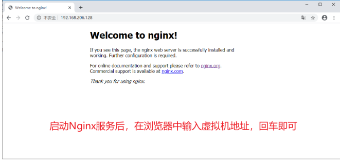
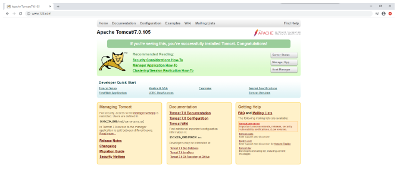
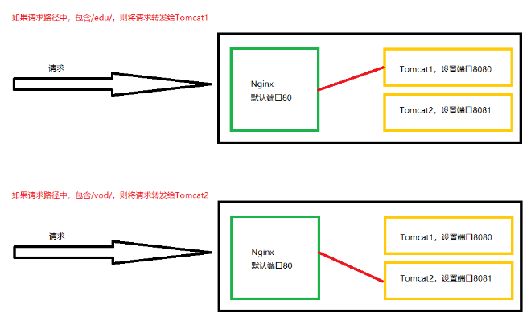
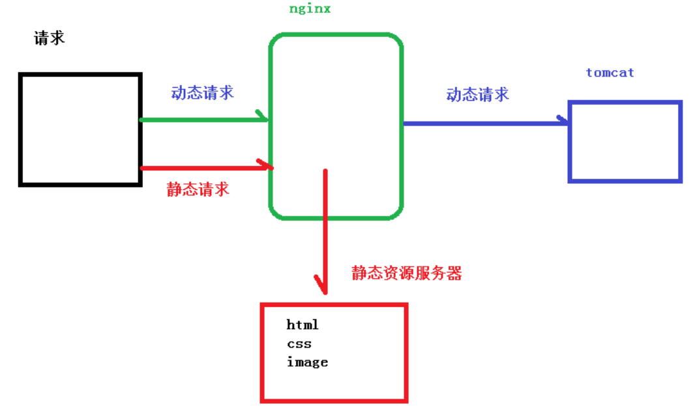
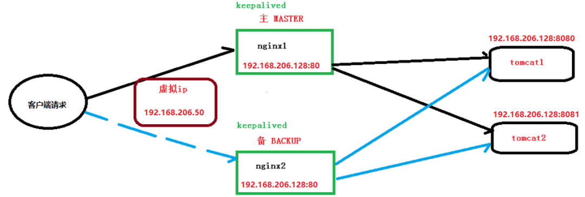
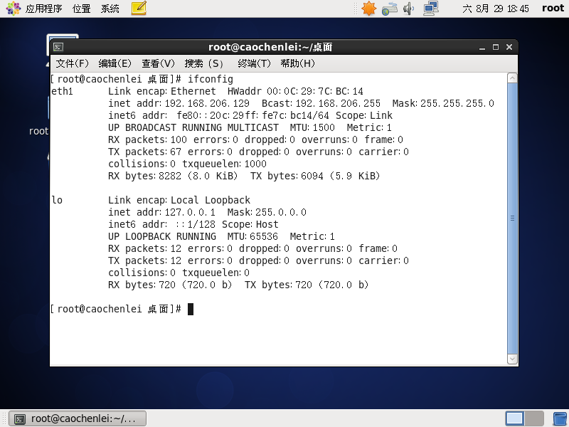
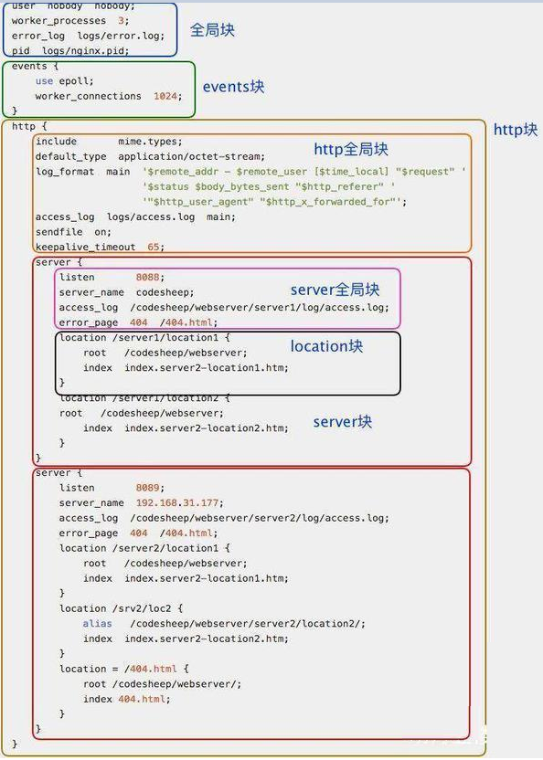

# 学习Nginx这一篇就够了
> 原文地址：https://mp.weixin.qq.com/s?__biz=MzU0OTE4MzYzMw==&mid=2247516769&idx=3&sn=2c9b6a79c8bd1476d99057caedb1875d&chksm=fbb10b9fccc682899bc443838d327796d909e217a21ba36d5853a31078e6bf81ccc47fc9bf89&scene=27

> 官网：https://nginx.org/

> 中文文档 ：https://blog.redis.com.cn/doc/index.html

## 第一章：Nginx概述

### 1.1、Nginx概述
Nginx（“engine x”）是一个高性能的HTTP和反向代理服务器，特点是占有内存少，并发能力强，事实上Nginx的并发能力确实在同类型的网页服务器中表现较好，中国大陆使用Nginx网站用户有：百度、京东、新浪、网易、腾讯、淘宝等。

### 1.2、Nginx用处
Nginx可以作为静态页面的Web服务器，同时还支持CGI协议的动态语言，比如Perl、PHP等。但是不支持Java。Java程序只能通过与Tomcat配合完成。Nginx专为性能优化而开发，性能是其最重要的考量，实现上非常注重效率，能经受高负载的考验，有报告表明能支持高达50000个并发连接数。

## 第二章：Nginx单实例安装

### 2.1、环境说明
模拟工具：VMware-workstation-full-15.5.6-16341506.exe

操作系统：CentOS-6.10-x86_64-bin-DVD1.iso、纯净安装、桌面版

内存大小：2GB

连接工具：SecureCRT

### 2.2、安装依赖
```shell
[root@caochenlei ~]# yum install -y gcc gcc-c++ make libtool wget pcre pcre-devel zlib zlib-devel openssl openssl-devel
```

### 2.3、Nginx下载
```shell
[root@caochenlei ~]# wget http://nginx.org/download/nginx-1.18.0.tar.gz
```

### 2.4、Nginx解压
```shell
[root@caochenlei ~]# tar -zxvf nginx-1.18.0.tar.gz
```

### 2.5、Nginx安装
```shell
[root@caochenlei ~]# cd nginx-1.18.0
[root@caochenlei nginx-1.18.0]# ./configure
[root@caochenlei nginx-1.18.0]# make && make install
```
注意：安装完成后的路径为：/usr/local/nginx

### 2.6、Nginx命令
普通启动服务：/usr/local/nginx/sbin/nginx

配置文件启动：/usr/local/nginx/sbin/nginx -c /usr/local/nginx/conf/nginx.conf

- 暴力停止服务：/usr/local/nginx/sbin/nginx -s stop

- 优雅停止服务：/usr/local/nginx/sbin/nginx -s quit

- 检查配置文件：/usr/local/nginx/sbin/nginx -t

- 重新加载配置：/usr/local/nginx/sbin/nginx -s reload

- 查看相关进程：ps -ef | grep nginx

### 2.7、开放防火墙
```shell
[root@caochenlei ~]# /sbin/iptables -I INPUT -p tcp --dport 80 -j ACCEPT
[root@caochenlei ~]# /etc/rc.d/init.d/iptables save
iptables：将防火墙规则保存到 /etc/sysconfig/iptables：[确定]
```
### 2.8、启动后效果


## 第三章：Nginx反向代理
### 3.1、概述

Nginx不仅可以做反向代理，还能用作正向代理来进行上网等功能，正向代理：如果把局域网外的Internet想象成一个巨大的资源库，则局域网中的客户端要访问Internet，则需要通过代理服务器来访问，这种代理服务就称为正向代理。对于反向代理，客户端对代理是无感知的，因为客户端不需要任何配置就可以访问，我们只需要将请求发送到反向代理服务器，由反向代理服务器去选择目标服务器获取数据后，在返回给客户端，此时反向代理服务器和目标服务器对外就是一个服务器，暴露的是代理服务器地址，隐藏了真实服务器IP地址。

### 3.2、配置反向代理实例1

#### 3.2.1、实现效果
打开浏览器，在浏览器地址栏输入地址：http://www.123.com，跳转到Liunx系统Tomcat主页面中。


#### 3.2.2、实现思路


#### 3.2.3、实现步骤

步骤一：修改Windows中的hosts域名映射

复制“C:\Windows\System32\drivers\etc\hosts”到桌面，右键记事本打开，在里边加上以下代码保存，然后再复制回去，不要直接修改，会不让保存！
```shell
#虚拟机域名       映射的网址
192.168.206.128 www.123.com
```
步骤二：修改Nginx中的配置文件并启动
```shell
[root@caochenlei ~]# vi /usr/local/nginx/conf/nginx.conf
```
```conf
server {
        listen       80;
        server_name  192.168.206.128;

        #charset koi8-r;

        #access_log  logs/host.access.log  main;

        location / {
            proxy_pass http:127.0.0.1:8080;
            root   html;
            index  index.html index.htm;
        }
}
```

```shell
[root@caochenlei ~]# /usr/local/nginx/sbin/nginx
```

步骤三：下载Tomcat、解压Tomcat、安装Tomcat、启动Tomcat

注意：Tomcat启动需要JDK，在这里我没有安装，使用系统自带的OpenJDK Runtime Environment (rhel-2.6.14.10.el6-x86_64 u181-b00)

下载：
```shell
[root@caochenlei ~]# wget https://mirror.bit.edu.cn/apache/tomcat/tomcat-7/v7.0.105/bin/apache-tomcat-7.0.105.tar.gz
```

解压：
```shell
[root@caochenlei ~]# tar -zxvf apache-tomcat-7.0.105.tar.gz
```

安装：
```shell
[root@caochenlei ~]# mv apache-tomcat-7.0.105 /usr/local/tomcat
```

启动：
```shell
[root@caochenlei ~]# /usr/local/tomcat/bin/startup.sh
```

添加到防火墙：
```shell
[root@caochenlei ~]# /sbin/iptables -I INPUT -p tcp --dport 80 -j ACCEPT
[root@caochenlei ~]# /etc/rc.d/init.d/iptables save
```

如果关闭请用：
```shell
[root@caochenlei ~]# /usr/local/tomcat/bin/shutdown.sh
```

#### 3.2.4、关闭服务
```shell
[root@caochenlei ~]# /usr/local/nginx/sbin/nginx -s quit
[root@caochenlei ~]# /usr/local/tomcat/bin/shutdown.sh
```

### 3.3、配置反向代理实例2

#### 3.3.1、实现效果

使用Nginx反向代理，根据访问的路径跳转到不同端口的服务中。


#### 3.3.2、实现思路

#### 3.3.3、实现步骤

步骤一：修改Nginx的配置文件，然后启动
```shell
[root@caochenlei ~]# vi /usr/local/nginx/conf/nginx.conf
```
```config
server {
        listen       80;
        server_name  192.168.206.128;

        #charset koi8-r;

        #access_log  logs/host.access.log  main;

        location ~ /edu/ {
            proxy_pass http://127.0.0.1:8080;
        }

        location ~ /vod/ {
            proxy_pass http://127.0.0.1:8081;
        }
}
```
```shell
[root@caochenlei ~]# /usr/local/nginx/sbin/nginx
```
步骤二：拷贝两个Tomcat，将其中一个的端口信息修改为8081，开启防火墙，然后分别启动这两台Tomcat

解压：
```shell
[root@caochenlei ~]# tar -zxvf apache-tomcat-7.0.105.tar.gz
[root@caochenlei ~]# mv apache-tomcat-7.0.105 /usr/local/tomcat1
```
```shell
[root@caochenlei ~]# tar -zxvf apache-tomcat-7.0.105.tar.gz
[root@caochenlei ~]# mv apache-tomcat-7.0.105 /usr/local/tomcat2
```
删除：
```shell
[root@caochenlei ~]# rm -f /usr/local/tomcat2/conf/server.xml
```
添加：
```shell
[root@caochenlei ~]# vi /usr/local/tomcat2/conf/server.xml
```
```xml
<?xml version='1.0' encoding='utf-8'?>
<!--
  Licensed to the Apache Software Foundation (ASF) under one or more
  contributor license agreements.  See the NOTICE file distributed with
  this work for additional information regarding copyright ownership.
  The ASF licenses this file to You under the Apache License, Version 2.0
  (the "License"); you may not use this file except in compliance with
  the License.  You may obtain a copy of the License at
      http://www.apache.org/licenses/LICENSE-2.0
  Unless required by applicable law or agreed to in writing, software
  distributed under the License is distributed on an "AS IS" BASIS,
  WITHOUT WARRANTIES OR CONDITIONS OF ANY KIND, either express or implied.
  See the License for the specific language governing permissions and
  limitations under the License.
-->
<!-- Note:  A "Server" is not itself a "Container", so you may not
     define subcomponents such as "Valves" at this level.
     Documentation at /docs/config/server.html
 -->
<Server port="8006" shutdown="SHUTDOWN">
  <Listener className="org.apache.catalina.startup.VersionLoggerListener" />
  <!-- Security listener. Documentation at /docs/config/listeners.html
  <Listener className="org.apache.catalina.security.SecurityListener" />
  -->
  <!--APR library loader. Documentation at /docs/apr.html -->
  <Listener className="org.apache.catalina.core.AprLifecycleListener" SSLEngine="on" />
  <!--Initialize Jasper prior to webapps are loaded. Documentation at /docs/jasper-howto.html -->
  <Listener className="org.apache.catalina.core.JasperListener" />
  <!-- Prevent memory leaks due to use of particular java/javax APIs-->
  <Listener className="org.apache.catalina.core.JreMemoryLeakPreventionListener" />
  <Listener className="org.apache.catalina.mbeans.GlobalResourcesLifecycleListener" />
  <Listener className="org.apache.catalina.core.ThreadLocalLeakPreventionListener" />
  <!-- Global JNDI resources
       Documentation at /docs/jndi-resources-howto.html
  -->
  <GlobalNamingResources>
    <!-- Editable user database that can also be used by
         UserDatabaseRealm to authenticate users
    -->
    <Resource name="UserDatabase" auth="Container"
              type="org.apache.catalina.UserDatabase"
              description="User database that can be updated and saved"
              factory="org.apache.catalina.users.MemoryUserDatabaseFactory"
              pathname="conf/tomcat-users.xml" />
  </GlobalNamingResources>
  <!-- A "Service" is a collection of one or more "Connectors" that share
       a single "Container" Note:  A "Service" is not itself a "Container",
       so you may not define subcomponents such as "Valves" at this level.
       Documentation at /docs/config/service.html
   -->
  <Service name="Catalina">
    <!--The connectors can use a shared executor, you can define one or more named thread pools-->
    <!--
    <Executor name="tomcatThreadPool" namePrefix="catalina-exec-"
        maxThreads="150" minSpareThreads="4"/>
    -->
    <!-- A "Connector" represents an endpoint by which requests are received
         and responses are returned. Documentation at :
         Java HTTP Connector: /docs/config/http.html (blocking & non-blocking)
         Java AJP  Connector: /docs/config/ajp.html
         APR (HTTP/AJP) Connector: /docs/apr.html
         Define a non-SSL HTTP/1.1 Connector on port 8080
    -->
    <Connector port="8081" protocol="HTTP/1.1"
               connectionTimeout="20000"
               redirectPort="8444" />
    <!-- A "Connector" using the shared thread pool-->
    <!--
    <Connector executor="tomcatThreadPool"
               port="8081" protocol="HTTP/1.1"
               connectionTimeout="20000"
               redirectPort="8444" />
    -->
    <!-- Define an SSL HTTP/1.1 Connector on port 8443
         This connector uses the BIO implementation that requires the JSSE
         style configuration. When using the APR/native implementation, the
         OpenSSL style configuration is required as described in the APR/native
         documentation -->
    <!--
    <Connector port="8444" protocol="org.apache.coyote.http11.Http11Protocol"
               maxThreads="150" SSLEnabled="true" scheme="https" secure="true"
               clientAuth="false" sslProtocol="TLS" />
    -->
    <!-- Define an AJP 1.3 Connector on port 8009 -->
    <!--
    <Connector protocol="AJP/1.3"
               address="::1"
               port="8010"
               redirectPort="8444" />
    -->
    <!-- An Engine represents the entry point (within Catalina) that processes
         every request.  The Engine implementation for Tomcat stand alone
         analyzes the HTTP headers included with the request, and passes them
         on to the appropriate Host (virtual host).
         Documentation at /docs/config/engine.html -->
    <!-- You should set jvmRoute to support load-balancing via AJP ie :
    <Engine name="Catalina" defaultHost="localhost" jvmRoute="jvm1">
    -->
    <Engine name="Catalina" defaultHost="localhost">
      <!--For clustering, please take a look at documentation at:
          /docs/cluster-howto.html  (simple how to)
          /docs/config/cluster.html (reference documentation) -->
      <!--
      <Cluster className="org.apache.catalina.ha.tcp.SimpleTcpCluster"/>
      -->
      <!-- Use the LockOutRealm to prevent attempts to guess user passwords
           via a brute-force attack -->
      <Realm className="org.apache.catalina.realm.LockOutRealm">
        <!-- This Realm uses the UserDatabase configured in the global JNDI
             resources under the key "UserDatabase".  Any edits
             that are performed against this UserDatabase are immediately
             available for use by the Realm.  -->
        <Realm className="org.apache.catalina.realm.UserDatabaseRealm"
               resourceName="UserDatabase"/>
      </Realm>
      <Host name="localhost"  appBase="webapps"
            unpackWARs="true" autoDeploy="true">
        <!-- SingleSignOn valve, share authentication between web applications
             Documentation at: /docs/config/valve.html -->
        <!--
        <Valve className="org.apache.catalina.authenticator.SingleSignOn" />
        -->
        <!-- Access log processes all example.
             Documentation at: /docs/config/valve.html
             Note: The pattern used is equivalent to using pattern="common" -->
        <Valve className="org.apache.catalina.valves.AccessLogValve" directory="logs"
               prefix="localhost_access_log." suffix=".txt"
               pattern="%h %l %u %t &quot;%r&quot; %s %b" />
      </Host>
    </Engine>
  </Service>
</Server>
```

开启Tomcat2的防火墙：
```shell
[root@caochenlei ~]# /sbin/iptables -I INPUT -p tcp --dport 8081 -j ACCEPT
[root@caochenlei ~]# /etc/rc.d/init.d/iptables save
```
在每一个Tomcat的WebApps中创建一个文件夹和一个a.html文件：
```shell
[root@caochenlei ~]# mkdir -p /usr/local/tomcat1/webapps/edu
[root@caochenlei ~]# echo "<h1>This is 8080 Port</h1>" > /usr/local/tomcat1/webapps/edu/a.html
```
```shell
[root@caochenlei ~]# mkdir -p /usr/local/tomcat2/webapps/vod
[root@caochenlei ~]# echo "<h1>This is 8081 Port</h1>" > /usr/local/tomcat2/webapps/vod/a.html
```
启动：
```shell
[root@caochenlei ~]# /usr/local/tomcat1/bin/startup.sh
[root@caochenlei ~]# /usr/local/tomcat2/bin/startup.sh
```
步骤三：打开本机浏览器进行测试

在浏览器输入：http://192.168.206.128/edu/a.html


在浏览器输入：http://192.168.206.128/vod/a.html


#### 3.3.4、关闭服务
```shell
[root@caochenlei ~]# /usr/local/nginx/sbin/nginx -s quit
[root@caochenlei ~]# /usr/local/tomcat1/bin/shutdown.sh
[root@caochenlei ~]# /usr/local/tomcat2/bin/shutdown.sh
```
### 3.4、location指令说明

描述：该指令用于匹配URL。

语法：
!(语法)[./.assets/QQ截图20230530153907.png]

通配符：

- =：用于不含正则表达式的uri前，要求请求字符串与uri严格匹配，如果匹配成功，就停止继续向下搜索并立即处理该请求。

- ~：用于表示uri包含正则表达式，并且区分大小写。

- ~*：用于表示uri包含正则表达式，并且不区分大小写。

- ^~：用于不含正则表达式的uri前，要求Nginx服务器找到标识uri和请求字符串匹配度最高的location后，立即使用此location处理请求，而不再使用location块中的正则uri和请求字符串做匹配。


注意：如果uri包含正则表达式，则必须要有~或者~*标识。

## 第四章：Nginx负载均衡
### 4.1、概述

客户端发送多个请求到服务器，服务器处理请求，有一些可能要与数据库进行交互，服务器处理完毕后，再将结果返回给客户端。

这种架构模式对于早期的系统相对单一，并发请求相对较少的情况下是比较适合的，成本也低。但是随着信息数量的不断增长，访问量和数据量的飞速增长，以及系统业务的复杂度增加，这种架构会造成服务器相应客户端的请求日益缓慢，并发量特别大的时候，还容易造成服务器直接崩溃。很明显这是由于服务器性能的瓶颈造成的问题，那么如何解决这种情况呢？

我们首先想到的可能是升级服务器的配置，比如提高CPU执行频率，加大内存等提高机器的物理性能来解决此问题，但是我们知道摩尔定律的日益失效，硬件的性能提升已经不能满足日益提升的需求了。最明显的一个例子，天猫双十一当天，某个热销商品的瞬时访问量是极其庞大的，那么类似上面的系统架构，将机器都增加到现有的顶级物理配置，都是不能够满足需求的。那么怎么办呢？

上面的分析我们去掉了增加服务器物理配置来解决问题的办法，也就是说纵向解决问题的办法行不通了，那么横向增加服务器的数量呢？这时候集群的概念产生了，单个服务器解决不了，我们增加服务器的数量，然后将请求分发到各个服务器上，将原先请求集中到单个服务器上的情况改为将请求分发到多个服务器上，将负载分发到不同的服务器，也就是我们所说的负载均衡。


### 4.2、实现效果

浏览器地址栏输入地址：http://192.168.206.128/edu/a.html，负载均衡效果，将请求平均到8080和8081端口中。


### 4.3、实现思路


### 4.4、实现步骤

第一步：修改Nginx的配置文件
```shell
[root@caochenlei ~]# vi /usr/local/nginx/conf/nginx.conf
```
```config
upstream myserver {
        server 192.168.206.128:8080;
        server 192.168.206.128:8081;
    }

    server {
        listen       80;
        server_name  192.168.206.128;

        #charset koi8-r;

        #access_log  logs/host.access.log  main;

        location / {
            proxy_pass http://myserver;
        }
    }
```
```shell
[root@caochenlei ~]# /usr/local/nginx/sbin/nginx
```

第二步：在Tomcat2的webapps文件夹中，创建一个edu文件夹，在里边创建a.html

创建：
```shell
[root@caochenlei ~]# mkdir -p /usr/local/tomcat2/webapps/edu
[root@caochenlei ~]# echo "<h1>This is 8081 Port</h1>" > /usr/local/tomcat2/webapps/edu/a.html
```
启动：
```shell
[root@caochenlei ~]# /usr/local/tomcat1/bin/startup.sh
[root@caochenlei ~]# /usr/local/tomcat2/bin/startup.sh
```
第三步：测试效果

打开IE浏览器输入：http://192.168.206.128/edu/a.html


打开IE浏览器输入：http://192.168.206.128/edu/a.html


### 4.5、关闭服务

```shell
[root@caochenlei ~]*# /usr/local/nginx/sbin/nginx -s quit*
[root@caochenlei ~]*# /usr/local/tomcat1/bin/shutdown.sh*
[root@caochenlei ~]*# /usr/local/tomcat2/bin/shutdown.sh*
```


### 4.6、分配策略


轮询（默认）：每个请求按时间顺序逐一分配到不同的后端服务器，如果后端服务器down掉，能自动剔除。


weight：weight代表权重，默认为1，权重越高被分配的客户端越多，weight和访问比率成正比，用于后端服务器性能不均的情况。例如：


ip_hash：每个请求按访问IP的hash结果分配，这样每个访客固定访问一个后端服务器，可以解决session的问题。例如：


fair（第三方）：按后端服务器的响应时间来分配请求，响应时间短的优先分配。例如：


## 第五章：Nginx动静分离

### 5.1、概述


Nginx动静分离简单来说就是把动态跟静态请求分开，不能理解成只是单纯的把动态页面和静态页面物理分离。严格意义上说应该是动态请求跟静态请求分开，可以理解成使用Nginx处理静态页面，Tomcat处理动态页面。动静分离从目前实现角度来讲大致分为两种，一种是纯粹把静态文件独立成单独的域名，放在独立的服务器上，也是目前主流推崇的方案；另外一种方法就是动态跟静态文件混合在一起发布，通过Nginx来分开。


### 5.2、实现效果


如果不设置动静分离，默认会通过Nginx的反向代理去找Tomcat对应的资源，现在我们在根目录下创建一个/data/www/文件夹，里边放上静态资源，比如一个html页面，在8080的那台Tomcat的WebApps下也创建一个www目录，同样是放一个静态资源，当输入这个静态资源的请求时，访问到的是/data/www中的数据。


### 5.3、实现思路




### 5.4、实现步骤


第一步：创建静态资源文件，为了对比，Tomcat中也放一个

第一步：创建静态资源文件，为了对比，Tomcat中也放一个

```shell
[root@caochenlei ~]*# mkdir -p /data/www/* [root@caochenlei ~]*# mkdir -p /usr/local/tomcat/webapps/ROOT/www* [root@caochenlei ~]*# echo "<h1>/data/www/a.html</h1>" > /data/www/a.html* [root@caochenlei ~]*# echo "<h1>/usr/local/tomcat/webapps/ROOT/www/a.html</h1>" > /usr/local/tomcat/webapps/ROOT/www/a.html*
```


第二步：修改Nginx的配置文件

```shell
[root@caochenlei ~]# vi /usr/local/nginx/conf/nginx.conf
```


```config
server {
        listen       80;
        server_name  192.168.206.128;

        #charset koi8-r;

        #access_log  logs/host.access.log  main;

        location /www/ {
            root /data/;
            index index.html index.htm;
        }
```

```shell
[root@caochenlei ~]# /usr/local/nginx/sbin/nginx
```

第三步：启动Tomcat

```
[root@caochenlei ~]# /usr/local/tomcat/bin/startup.sh
```

第四步：启动浏览器进行测试


打开浏览器输入：http://192.168.206.128/www/a.html


### 5.5、关闭服务

```shell
[root@caochenlei ~]# /usr/local/nginx/sbin/nginx -s quit
[root@caochenlei ~]# /usr/local/tomcat/bin/shutdown.sh
```

## 第六章：Nginx高可用集群

### 6.1、概述


前边我们学习了反向代理、负载均衡、动静分离，但试想一下，如果Nginx挂掉了，那么服务肯定就没有了，有没有一种解决方案，可以保证Nginx挂掉了，服务也可以照常使用，答案肯定是有的，这就是我们接下来要学习的高可用集群，采用的是一主一备的模式，当主节点Nginx挂掉，备份服务器Nginx立刻跟上，这样就保证了服务的高可用性。

### 6.2、实现效果


当主节点Nginx挂掉以后，服务依然可以正常使用。


### 6.3、实现思路





### 6.4、实现步骤

第一步：修改主


Kubernetes 是目前唯一被业界广泛认可的 Docker 分布式解决方案。通过Kubernetes，我们可以轻装上阵的开发与管理复杂的业务系统。Kubernetes 已经毫无疑问地成为容器领域当之无愧的事实标准。


节点上的Nginx的配置文件

```shell
[root@caochenlei ~]# vi /usr/local/nginx/conf/nginx.conf
```


```config
upstream myserver {
        server 192.168.206.128:8080;
        server 192.168.206.128:8081;
    }

    server {
        listen       80;
        server_name  192.168.206.128;

        #charset koi8-r;

        #access_log  logs/host.access.log  main;

        location / {
            proxy_pass http://myserver;
        }

```

```shell
[root@caochenlei ~]# /usr/local/nginx/sbin/nginx
```

第二步：启动主节点上的两台Tomcat

```shell
[root@caochenlei ~]# /usr/local/tomcat1/bin/startup.sh
[root@caochenlei ~]# /usr/local/tomcat2/bin/startup.sh
```

第三步：安装主节点上的keepalived


安装keepalived：

```shell
[root@caochenlei ~]# yum install -y keepalived
```

删除keepalived的配置文件：

```shell
[root@caochenlei ~]# rm -f /etc/keepalived/keepalived.conf
```

新增keepalived的配置文件：

```shell
[root@caochenlei ~]# vi /etc/keepalived/keepalived.conf
```

注意：一定要注意router_id、state、interface的值，我就在这里踩坑了。

```config
! Configuration File for keepalived

global_defs {
   notification_email {
     acassen@firewall.loc
     failover@firewall.loc
     sysadmin@firewall.loc
   }
   notification_email_from Alexandre.Cassen@firewall.loc
   #邮件服务器通知地址（暂不配置，默认即可）
   smtp_server 192.168.200.1
   #邮件服务器超时时间（暂不配置，默认即可）
   smtp_connect_timeout 30
   #当前虚拟机的IP地址
   router_id 192.168.206.128
}

vrrp_script Monitor_Nginx {
 script "/etc/keepalived/nginx_check.sh"    #检测脚本执行的路径
 interval 2                                 #检测脚本执行的间隔
 weight 2                                   #检测脚本执行的权重
}

vrrp_instance VI_1 {
    state MASTER         #标识这个机器是MASTER还是BACKUP
    interface eth0       #当前机器的网卡名称  
    virtual_router_id 51 #虚拟路由的编号，主备必须一致
    priority 100         #主、备机取不同的优先级，主机值较大，备份机值较小
    advert_int 1         #（VRRP Multicast广播周期秒数）
    authentication {
        auth_type PASS   #（VRRP认证方式）
        auth_pass 1111   #（密码）
    }
    track_script {
  Monitor_Nginx #（调用Nginx进程检测脚本）
 }
    virtual_ipaddress {
        192.168.206.50  #虚拟IP地址
    }
}
```

新增keepalived的检测脚本：

```shell
[root@caochenlei ~]# vi /etc/keepalived/nginx_check.sh
```


```
#!/bin/bash
if [ "$(ps -ef | grep "nginx: master process" | grep -v grep )" == "" ]
 then
 killall keepalived
fi
```

启动keepalived服务：

```
[root@caochenlei ~]# service keepalived start
```

第四步：准备一台全新的虚拟机，安装Nginx和keepalived

启动虚拟机：





安装Nginx依赖：

```shell
[root@caochenlei ~]*# yum install -y gcc gcc-c++ make libtool wget pcre pcre-devel zlib zlib-devel openssl openssl-devel*
```

下载Nginx文件：

```shell
[root@caochenlei ~]# wget http://nginx.org/download/nginx-1.18.0.tar.gz
```

安装Nginx程序：

```shell
[root@caochenlei ~]# tar -zxvf nginx-1.18.0.tar.gz
[root@caochenlei ~]# cd nginx-1.18.0
[root@caochenlei nginx-1.18.0]# ./configure
[root@caochenlei nginx-1.18.0]# make && make install
[root@caochenlei nginx-1.18.0]# cd ~
```

开放Nginx防火墙：

```shell
[root@caochenlei ~]# /sbin/iptables -I INPUT -p tcp --dport 80 -j ACCEPT
[root@caochenlei ~]# /etc/rc.d/init.d/iptables save
iptables：将防火墙规则保存到 /etc/sysconfig/iptables：     [确定]
```

修改Nginx的配置：

```shell
[root@caochenlei ~]# vi /usr/local/nginx/conf/nginx.conf
```


```config

upstream myserver {
        server 192.168.206.128:8080;
        server 192.168.206.128:8081;
    }

    server {
        listen       80;
        server_name  192.168.206.128;

        #charset koi8-r;

        #access_log  logs/host.access.log  main;

        location / {
            proxy_pass http://myserver;
        }
}
```

启动Nginx的服务：

```shell
[root@caochenlei ~]# /usr/local/nginx/sbin/nginx
```

安装keepalived：

```shell
[root@caochenlei ~]# yum install -y keepalived
```

删除keepalived的配置文件：

```shell
[root@caochenlei ~]# rm -f /etc/keepalived/keepalived.conf
```

新增keepalived的配置文件：

```shell
[root@caochenlei ~]# vi /etc/keepalived/keepalived.conf
```

注意：一定要注意router_id、state、interface的值，我就在这里踩坑了。

```shell
! Configuration File for keepalived

global_defs {
   notification_email {
     acassen@firewall.loc
     failover@firewall.loc
     sysadmin@firewall.loc
   }
   notification_email_from Alexandre.Cassen@firewall.loc
   #邮件服务器通知地址（暂不配置，默认即可）
   smtp_server 192.168.200.1
   #邮件服务器超时时间（暂不配置，默认即可）
   smtp_connect_timeout 30
   #当前虚拟机的IP地址
   router_id 192.168.206.129
}

vrrp_script Monitor_Nginx {
 script "/etc/keepalived/nginx_check.sh"    #检测脚本执行的路径
 interval 2                                 #检测脚本执行的间隔
 weight 2                                   #检测脚本执行的权重
}

vrrp_instance VI_1 {
    state BACKUP         #标识这个机器是MASTER还是BACKUP
    interface eth1       #当前机器的网卡名称  
    virtual_router_id 51 #虚拟路由的编号，主备必须一致
    priority 10          #主、备机取不同的优先级，主机值较大，备份机值较小
    advert_int 1         #（VRRP Multicast广播周期秒数）
    authentication {
        auth_type PASS   #（VRRP认证方式）
        auth_pass 1111   #（密码）
    }
    track_script {
  Monitor_Nginx    #（调用Nginx进程检测脚本）
 }
    virtual_ipaddress {
        192.168.206.50   #虚拟IP地址
    }
}
```

新增keepalived的检测脚本：

```shell
[root@caochenlei ~]# vi /etc/keepalived/nginx_check.sh
```


```

#!/bin/bash
if [ "$(ps -ef | grep "nginx: master process" | grep -v grep )" == "" ]
 then
 killall keepalived
fi
```

启动keepalived服务：

```
[root@caochenlei ~]# service keepalived start
```

第五步：测试两个Nginx是否能正确的将请求分发到不同的Tomcat（负载均衡）


打开IE浏览器输入：http://192.168.206.128/edu/a.html


按住F5多刷新两遍，看看会不会，将请求转发到Tomcat2中去。


打开IE浏览器输入：http://192.168.206.129/edu/a.html


按住F5多刷新两遍，看看会不会，将请求转发到Tomcat2中去。


打开IE浏览器输入：http://192.168.206.50/edu/a.html，测试虚拟IP能不能实现负载均衡。


按住F5多刷新两遍，看看会不会，将请求转发到Tomcat2中去。


经过测试，我们发现一主一从、虚拟IP都能正常的进行负载均衡，接下来我们测试主节点挂掉，从节点会不会自动顶上，打开主节点机器，查看相关进程，杀死Nginx，然后打开浏览器，输入配置的虚拟IP地址：http://192.168.206.50/edu/a.html，发现负载均衡的效果还在，说明配置成功了。


###  6.5、关闭服务


主机节点：

```shell
[root@caochenlei ~]# service keepalived stop
[root@caochenlei ~]# /usr/local/nginx/sbin/nginx -s quit
[root@caochenlei ~]# /usr/local/tomcat1/bin/shutdown.sh
[root@caochenlei ~]# /usr/local/tomcat2/bin/shutdown.sh
```

备份节点：

```shell
[root@caochenlei ~]# service keepalived stop
[root@caochenlei ~]# /usr/local/nginx/sbin/nginx -s quit
```

## 第七章：Nginx配置详解


Nginx是通过配置文件来做到各个功能的实现的。Nginx的配置文件的格式非常合乎逻辑，学习这种格式以及如何使用这种每个部分是基础，这将帮助我们有可能手工创建一个配置文件。

### 7.1、整体结构图


### 7.2、配置演示图





### 7.3、全局块


配置影响Nginx全局的指令。主要包括：


- 配置运行Nginx服务器用户（组）
- worker process数
- Nginx进程
- PID存放路径错误日志的存放路径
- 一个Nginx进程打开的最多文件描述符数目

例如：

```
#配置worker进程运行用户（和用户组），nobody也是一个Linux用户，一般用于启动程序，没有密码
user nobody;
#user www www;

#配置工作进程数目，根据硬件调整，通常等于CPU数量或者2倍于CPU数量
worker_processes 1;

#配置全局错误日志及类型，[debug | info | notice | warn | error | crit]，默认是error
error_log logs/error.log;
#error_log logs/error.log notice;
#error_log logs/error.log info;

#配置进程pid文件
pid logs/nginx.pid;

#一个nginx进程打开的最多文件描述符数目，理论值应该是最多打开文件数（系统的值ulimit -n）与Nginx进程数相除，但是Nginx分配请求并不均匀，所以建议与ulimit -n的值保持一致。
worker_rlimit_nofile 65535;
```

### 7.4、events块


配置影响Nginx服务器或与用户的网络连接。主要包括：


- 事件驱动模型的选择
- 最大连接数的配置


例如：

```
#参考事件模型，use [ kqueue | rtsig | epoll | /dev/poll | select | poll ]; 
#epoll模型是Linux 2.6以上版本内核中的高性能网络I/O模型，如果跑在FreeBSD上面，就用kqueue模型。
use epoll;

#单个进程最大连接数（最大连接数=连接数*进程数）
worker_connections 65535;
```

### 7.5、http块


可以嵌套多个server，配置代理，缓存，日志定义等绝大多数功能和第三方模块的配置。主要包括：


- 定义MIMI-Type
- 自定义服务日志
- 允许sendfile方式传输文件
- 连接超时时间
- 单连接请求数上限


例如：

```
#常见的一些基础配置
include mime.types; #文件扩展名与文件类型映射表
default_type application/octet-stream; #默认文件类型
charset utf-8; #默认编码
server_names_hash_bucket_size 128; #服务器名字的hash表大小
client_header_buffer_size 32k; #上传文件大小限制
large_client_header_buffers 4 64k; #设定请求缓冲
client_max_body_size 8m; #设定请求缓冲
sendfile on; #开启高效文件传输模式，对于普通应用设为on，如果用来进行下载等应用磁盘IO重负载应用，可设置为off，以平衡磁盘与网络I/O处理速度，降低系统的负载。注意：如果图片显示不正常把这个改成off。
autoindex on; #开启目录列表访问，合适下载服务器，默认关闭。
tcp_nopush on; #防止网络阻塞
tcp_nodelay on; #防止网络阻塞
keepalive_timeout 120; #长连接超时时间，单位是秒

#FastCGI相关参数是为了改善网站的性能：减少资源占用，提高访问速度。
fastcgi_connect_timeout 300;
fastcgi_send_timeout 300;
fastcgi_read_timeout 300;
fastcgi_buffer_size 64k;
fastcgi_buffers 4 64k;
fastcgi_busy_buffers_size 128k;
fastcgi_temp_file_write_size 128k;

#gzip模块设置
gzip on; #开启gzip压缩输出
gzip_min_length 1k; #最小压缩文件大小
gzip_buffers 4 16k; #压缩缓冲区
gzip_http_version 1.0; #压缩版本（默认1.1，前端如果是squid2.5请使用1.0）
gzip_comp_level 2; #压缩等级
gzip_types text/plain application/x-javascript text/css application/xml; #压缩类型
gzip_vary on; #增加响应头'Vary: Accept-Encoding'
limit_zone crawler $binary_remote_addr 10m; #开启限制IP连接数的时候需要使用
```

### 7.6、server块


配置虚拟主机的相关参数，一个http中可以有多个server。主要包括：


- 配置网络监听
- 配置https服务
- 基于名称的虚拟主机配置
- 基于IP的虚拟主机配置


例如：

```
#虚拟主机的常见配置
server {
    listen       80; #配置监听端口
    server_name  localhost; #配置服务名
    charset utf-8; #配置字符集
    access_log  logs/host.access.log  main; #配置本虚拟主机的访问日志
    
    location / {
        root html; #root是配置服务器的默认网站根目录位置，默认为Nginx安装主目录下的html目录
        index index.html index.htm; #配置首页文件的名称
    }
    
    error_page 404             /404.html; #配置404错误页面
    error_page 500 502 503 504 /50x.html; #配置50x错误页面
}

#配置https服务，安全的网络传输协议，加密传输，端口443
server {
    listen       443 ssl;
    server_name  localhost;

    ssl_certificate      cert.pem;
    ssl_certificate_key  cert.key;

    ssl_session_cache    shared:SSL:1m;
    ssl_session_timeout  5m;

    ssl_ciphers  HIGH:!aNULL:!MD5;
    ssl_prefer_server_ciphers  on;

    location / {
        root   html;
        index  index.html index.htm;
    }
}
```

### 7.7、location块


配置请求的路由，以及各种页面的处理情况。主要包括：


- 请求根目录配置更改
- 网站默认首页配置
- location的URI


例如：

```
root html; #root是配置服务器的默认网站根目录位置，默认为Nginx安装主目录下的html目录
index index.html index.htm; #配置首页文件的名称

proxy_pass http://127.0.0.1:88; #反向代理的地址
proxy_redirect off; #是否开启重定向
#后端的Web服务器可以通过X-Forwarded-For获取用户真实IP
proxy_set_header X-Real-IP $remote_addr;
proxy_set_header X-Forwarded-For $proxy_add_x_forwarded_for;
proxy_set_header Host $host;
#以下是一些反向代理的配置，可选。
client_max_body_size 10m; #允许客户端请求的最大单文件字节数
client_body_buffer_size 128k; #缓冲区代理缓冲用户端请求的最大字节数，
proxy_connect_timeout 90; #nginx跟后端服务器连接超时时间（代理连接超时）
proxy_send_timeout 90; #后端服务器数据回传时间（代理发送超时）
proxy_read_timeout 90; #连接成功后，后端服务器响应时间（代理接收超时）
proxy_buffer_size 4k; #设置代理服务器（Nginx）保存用户头信息的缓冲区大小
proxy_buffers 4 32k; #proxy_buffers缓冲区，网页平均在32k以下的设置
proxy_busy_buffers_size 64k; #高负荷下缓冲大小（proxy_buffers*2）
proxy_temp_file_write_size 64k;  #设定缓存文件夹大小
```

location的URI：


描述：该指令用于匹配URL

语法：


通配符：


- =：用于不含正则表达式的uri前，要求请求字符串与uri严格匹配，如果匹配成功，就停止继续向下搜索并立即处理该请求。
- ~：用于表示uri包含正则表达式，并且区分大小写。
- ~*：用于表示uri包含正则表达式，并且不区分大小写。
- ^~：用于不含正则表达式的uri前，要求Nginx服务器找到标识uri和请求字符串匹配度最高的location后，立即使用此location处理请求，而不再使用location块中的正则uri和请求字符串做匹配。


注意：如果uri包含正则表达式，则必须要有~或者~*标识。

## 第八章：Nginx原理分析

### 8.1、Nginx的线程模型？


Nginx默认采用多进程工作方式，Nginx启动后，会运行一个master进程和多个worker进程。其中master充当整个进程组与用户的交互接口，同时对进程进行监护，管理worker进程来实现重启服务、平滑升级、更换日志文件、配置文件实时生效等功能。worker用来处理基本的网络事件，worker之间是平等的，他们共同竞争来处理来自客户端的请求。


Nginx的进程模型如图所示：


### 8.2、worker的工作模式？

worker对于连接是采用争抢的模式，谁先抢到就先交给谁处理，如果想要重新更新配置，由于已经抢到任务的worker不会参与争抢，那些空闲的worker就会去争抢连接，拿到连接后会自动更新配置信息，当那些有任务的worker完成任务后，会自动更新配置，这样就实现了无缝热部署。由于每个worker是独立的进程，如果有其中的一个worker出现问题，并不会影响其它worker继续进行争抢，在实现请求的过程，不会造成服务中断，建议worker数和服务器的CPU数相等是最为适宜的。


### 8.3、如何计算worker连接数？


如果只访问Nginx的静态资源，一个发送请求会占用了woker的2个连接数

而如果是作为反向代理服务器，一个发送请求会占用了woker的4个连接数


### 8.4、如何计算最大的并发数？


如果只访问nginx的静态资源，最大并发数量应该是：worker_connections * worker_processes / 2


而如果是作为反向代理服务器，最大并发数量应该是：worker_connections * worker_processes / 4


原文链接：https://blog.csdn.net/qq_38490457/article/details/108300342