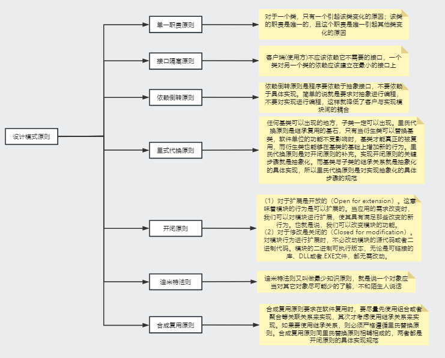
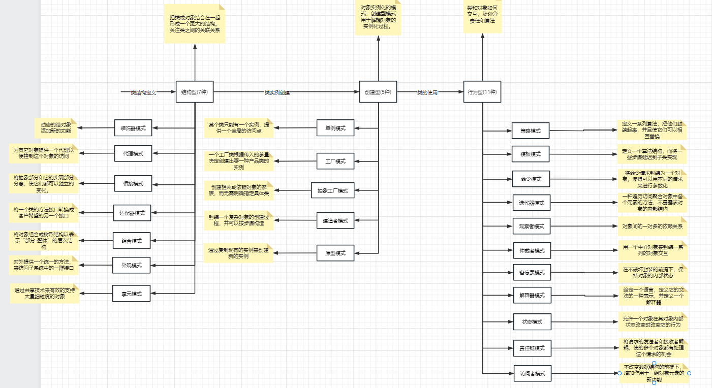
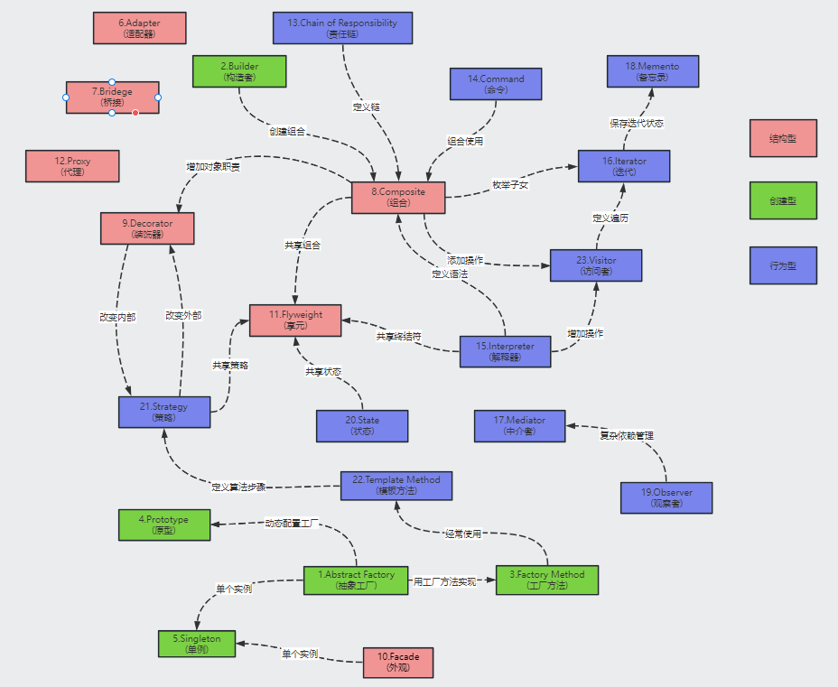

# 设计模式
## 原则

## 概览

## 各个模式之间的关系

## 小总结

从迭代器开始，我们将类中数据结构的遍历和类的功能实现分离出来，本质上使用了工厂模式；

其次我们学习了适配器模式，它将不同的接口进行适配，从而便于版本的兼容性以及其他功能；

然后我们学习了模板方法，使用模板面向抽象编程，便于新的子类的实现和管理；

之后学习了工厂模式，其实借用了模板模式来创建产品，是一种非常重要用处很广的一种方法；

然后我们学习了单例模式，有懒汉式、饿汉式等，生成关于某个类全局唯一的对象，注意多线程的影响；

之后是原型模式，用来复制复杂的对象，使用了clone方法，然后是builder模式，用一个新的类对已有的抽象接口进行整合和编程，从而构建出我们想要的东西；

然后是抽象工厂模式，使用了工厂模式，组合模式等模式，面向抽象编程，将抽象零件组装成抽象产品，便于具体工厂的创建，提高了代码的组件化和复用性；

然后是桥接模式，将类的功能层次和实现层次分割开来，便于对应的扩展和使用；

然后是策略模式，可以整体的替换策略，使用也很广泛；然后是组合模式，保证了同根同源，通过委托添加自己构成递归，树形结构，将具有树形特点的对象组合起来；

然后是装饰器模式，和组合模式的结构类似，同样是递归结构，从而可以不断的装饰，增加新的功能，很好用；

接着是visitor访问者模式，通过在类外访问类中的数据结构从而得到想要的结果，便于程序的可扩展性和组件化；

接着是责任链模式，推卸责任，根据问题的大小来考虑自己释放处理，本质是链表，便于职责分明；

然后是外观模式，通过整合各个类之间的调用关系，组建成了统一的接口(API)，便于外部类的调用；

接着是仲裁者模式，将很多类之间互相关联的关系交给仲裁者处理，省去了各个类之间的嵌套和调动，有利于高内聚和低耦合，思路清晰，便于扩展；

然后是观察者模式，通过互相委托从而能够在被观察的类发生改变的时候得到相应的改变的信息并且处理；

然后是备忘录模式，通过在某一时刻的状态保存下来，便于恢复，在游戏中使用的比较多；

然后是状态模式，将状态当做类，从而职责分明，解除了很多繁琐的if和else这些分支逻辑，便于扩展；

然后是享元模式，轻量级对象，通过共用不变对象来实现；

然后是代理模式，懒加载真正的服务器，加快访问速度，代理是帮助服务器代理的；

然后是命令模式，将命令当做类，通过保存一些列命令，从而能够随时执行这些命令，需要清除命令的本质就是一些操作和数据；

最后是解释器模式，利用编程原理的方法，来更高层次的封装代码，将自己开发的java代码当做编译系统，从而不用改变java代码只修改更高语言层次的代码就能实现不同的功能。

​	

